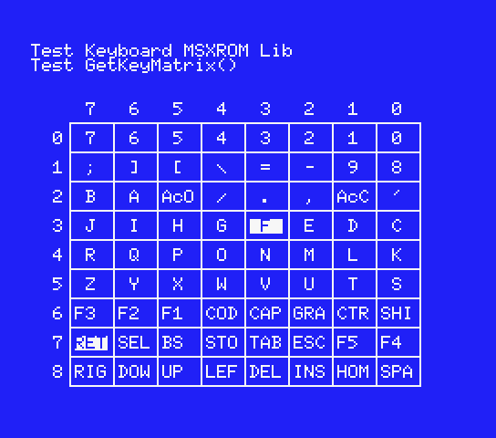
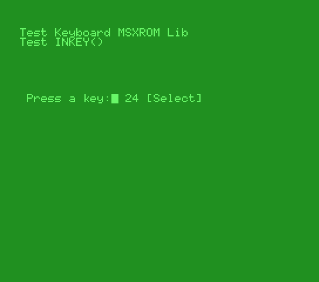

# Keyboard MSX ROM SDCC Library (fR3eL Project)

```
Architecture: MSX
Format: C Object (SDCC .rel)
Programming language: C and Z80 assembler
```

---

## Description

Library with basic functions for reading the keyboard of MSX computers.

This library uses functions from the MSX BIOS, so it is designed to create applications in ROM format.
  
Use them for developing MSX applications using Small Device C Compiler (SDCC).

This project is an Open Source library. 
You can add part or all of this code in your application development or include it in other libraries/engines.

You can access the documentation here with [`How to use the library`](docs/HOWTO.md).

In the source code [`examples/`](examples/), you can find applications for testing and learning purposes.

This library is part of the [MSX fR3eL Project](https://github.com/mvac7/SDCC_MSX_fR3eL).

Enjoy it!

<br/>

---

## History of versions:

- v1.1 (30/11/2023) update to SDCC (4.1.12) Z80 calling conventions
- v1.0 (7/3/2016) first version

<br/>

---

## Requirements

- [Small Device C Compiler (SDCC) v4.3](http://sdcc.sourceforge.net/)
- [Hex2bin v2.5](http://hex2bin.sourceforge.net/)

<br/>

---

## Functions

| Function | Description |
| :---     | :---        |
| **KillBuffer**() | Clear keyboard buffer |
| **INKEY**() | Waits for a key press and returns its value |
| **GetKeyMatrix**(row) | Returns the value of the specified line from the keyboard matrix |

<br/>

---

## Code Examples

In the git project [`examples/`](../examples/), you can find the source code of applications for testing and learning purposes.

<br/>

### TEST_GetKeyMatrix

Test the GetKeyMatrix function.

[`examples/testLib`](examples/TEST_GetKeyMatrix)

 

<br/>

### TEST_INKEY

Test the INKEY function.

[`examples/test80c`](examples/TEST_INKEY)

 
