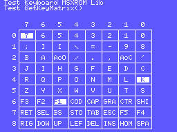
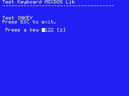

# Keyboard MSX SDCC Library (fR3eL Project)

<table>
<tr><td>Architecture</td><td>MSX</td></tr>
<tr><td>Format</td><td>C Object (SDCC .rel)</td></tr>
<tr><td>Programming language</td><td>C and Z80 assembler</td></tr>
<tr><td>Compiler</td><td>SDCC v4.4 or newer</td></tr>
</table>

---

## Description

Library with basic functions for reading the keyboard of MSX computers.

In this project you will find two libraries for different environments:
- **keyboard_MSXBIOS** Uses the MSX BIOS. It takes up very little memory. You can use it to develop applications in ROM format or programs that run from MSX BASIC environment.
- **keyboard_MSXDOS** Uses the MSX BIOS functions via inter-slot call (CALSLT). You can use it to develop applications for the MSX-DOS environment.
  
These libraries are part of the [MSX fR3eL Project](https://github.com/mvac7/SDCC_MSX_fR3eL).

You can access the documentation here with [`How to use the library`](docs/HOWTO.md).

Use them for developing MSX applications using Small Device C Compiler [`SDCC`](http://sdcc.sourceforge.net/).

This project is an Open Source. 
You can add part or all of this code in your application development or include it in other libraries/engines.

Enjoy it!

 

---

## History of versions:

### keyboard_MSXBIOS
- v1.1 (30/11/2023) update to SDCC (4.1.12) Z80 calling conventions
- v1.0 (7/3/2016) first version

 

### keyboard_MSXDOS
- v1.1 (8/12/2023) update to SDCC (4.1.12) Z80 calling conventions
- v1.0 (2/3/2016) first version

 

---

## Requirements

- [Small Device C Compiler (SDCC) v4.4](http://sdcc.sourceforge.net/)
- [Hex2bin v2.5](http://hex2bin.sourceforge.net/)

 

---

## Functions

| Function | Description |
| :---     | :---        |
| **KillBuffer**() | Clear keyboard buffer |
| **INKEY**() | Waits for a key press and returns its value |
| **GetKeyMatrix**(row) | Returns the value of the specified line from the keyboard matrix |

 

---

## Code Examples

In the git project [`examples/`](../examples/), you can find the source code of applications for testing and learning purposes.

 

### Example 1 Test INKEY (ROM)

Test of the INKEY function of the keyboard_MSXBIOS library.

[`examples/Example01_INKEY_ROM`](examples/Example01_INKEY_ROM)

 

 

### Example 2 Test GetKeyMatrix (ROM)

Test of the GetKeyMatrix function of the keyboard_MSXBIOS library.

[`examples/Example02_GetKeyMatrix_ROM`](examples/Example02_GetKeyMatrix_ROM)

 

 

### Example 3 Test INKEY (MSX-DOS)

Test of the INKEY function of the keyboard_MSXDOS library.

[`examples/Example03_INKEY_MSXDOS`](examples/Example03_INKEY_MSXDOS)

 

 

### Example 4 Test GetKeyMatrix (MSX-DOS)

Test of the GetKeyMatrix function of the keyboard_MSXDOS library.

[`examples/Example04_GetKeyMatrix_MSXDOS`](examples/Example04_GetKeyMatrix_MSXDOS)

 

 
